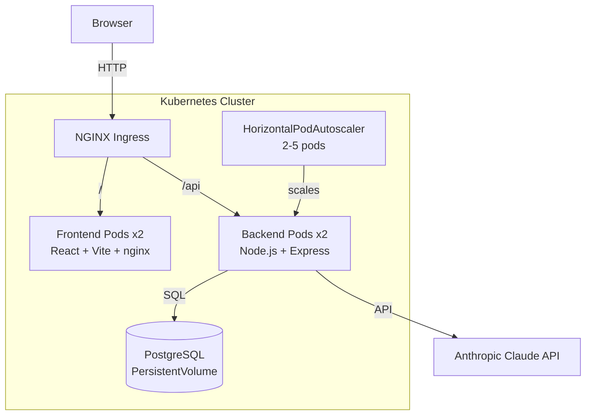

# DevBoard

A full-stack kanban-style task management application built with modern technologies. This project demonstrates production-grade software engineering practices including containerization, orchestration, and AI integration.


## ✨ Features

- **Kanban Board** — drag and drop tasks across To Do, In Progress and Done columns
- **Authentication** — JWT-based register and login
- **AI Integration** — generate task descriptions and break down goals into tasks using Claude AI
- **Real-time updates** — optimistic UI updates with TanStack Query
- **Production ready** — Dockerized, Kubernetes deployed with load balancing and autoscaling

## 🏗 Architecture



## 🛠 Tech Stack

### Frontend

| Technology            | Purpose                   |
| --------------------- | ------------------------- |
| React 19 + TypeScript | UI framework              |
| Vite 8                | Build tool and dev server |
| Tailwind CSS 4        | Styling                   |
| TanStack Query        | Data fetching and caching |
| Zustand               | Global state management   |
| @hello-pangea/dnd     | Drag and drop             |
| React Router          | Client-side routing       |

### Backend

| Technology             | Purpose                     |
| ---------------------- | --------------------------- |
| Node.js 24 + Express 5 | HTTP server                 |
| TypeScript             | Type safety                 |
| Kysely                 | Type-safe SQL query builder |
| PostgreSQL 16          | Database                    |
| JWT + bcryptjs         | Authentication              |
| Zod 4                  | Request validation          |
| Pino                   | Structured logging          |
| Anthropic SDK          | AI integration              |

### Infrastructure

| Technology              | Purpose                        |
| ----------------------- | ------------------------------ |
| Docker + Docker Compose | Containerization and local dev |
| Kubernetes + Minikube   | Container orchestration        |
| NGINX Ingress           | Load balancing and routing     |
| HorizontalPodAutoscaler | Auto-scaling                   |
| GitHub Actions          | CI/CD pipeline                 |
| pnpm workspaces         | Monorepo management            |

## 📁 Project Structure

```
devboard/
├── apps/
│   ├── frontend/          # React + TypeScript (Vite)
│   └── backend/           # Node.js + Express + TypeScript
├── packages/
│   └── shared/            # Shared TypeScript types
├── k8s/
│   ├── postgres/          # PostgreSQL manifests
│   ├── backend/           # Backend manifests + HPA
│   ├── frontend/          # Frontend manifests
│   └── ingress/           # NGINX ingress
├── .github/
│   └── workflows/         # GitHub Actions CI/CD
├── docker-compose.yml     # Local development
└── README.md
```

## 🚀 Getting Started

### Prerequisites

- Node.js 24+
- pnpm 11+
- Docker Desktop
- kubectl + Minikube (for Kubernetes)

### Local Development

**1. Clone the repository:**

```bash
git clone https://github.com/Asmatchd/devboard.git
cd devboard
```

**2. Install dependencies:**

```bash
pnpm install
```

**3. Set up environment variables:**

```bash
cp apps/backend/.env.example apps/backend/.env
# Edit .env with your values
```

**4. Start the database:**

```bash
pnpm dev:db
```

**5. Run migrations and seed:**

```bash
cd apps/backend
pnpm db:migrate
pnpm db:seed
```

**6. Start the development servers:**

```bash
pnpm dev:all
```

Open `http://localhost:5173`

**Test credentials:**

- Email: `test@devboard.com`
- Password: `password123`

### Docker

```bash
pnpm docker:build
pnpm docker:up
```

Open `http://localhost:5173`

### Kubernetes

**1. Start Minikube:**

```bash
pnpm k8s:start
```

**2. Build images into Minikube:**

```bash
eval $(minikube docker-env)
docker compose build
```

**3. Deploy:**

```bash
pnpm k8s:deploy
```

**4. Start tunnel (keep terminal open):**

```bash
pnpm k8s:tunnel
```

Open `http://devboard.local`

## 🔑 Environment Variables

| Variable            | Description                          | Required           |
| ------------------- | ------------------------------------ | ------------------ |
| `PORT`              | Backend server port                  | No (default: 3001) |
| `DATABASE_URL`      | PostgreSQL connection string         | Yes                |
| `JWT_SECRET`        | Secret key for JWT signing           | Yes                |
| `NODE_ENV`          | Environment (development/production) | No                 |
| `ANTHROPIC_API_KEY` | Anthropic API key for AI features    | No                 |

## 📡 API Endpoints

### Auth

| Method | Endpoint             | Description       | Auth |
| ------ | -------------------- | ----------------- | ---- |
| POST   | `/api/auth/register` | Register new user | No   |
| POST   | `/api/auth/login`    | Login             | No   |
| GET    | `/api/auth/me`       | Get current user  | Yes  |

### Tasks

| Method | Endpoint         | Description   | Auth |
| ------ | ---------------- | ------------- | ---- |
| GET    | `/api/tasks`     | Get all tasks | Yes  |
| POST   | `/api/tasks`     | Create task   | Yes  |
| PATCH  | `/api/tasks/:id` | Update task   | Yes  |
| DELETE | `/api/tasks/:id` | Delete task   | Yes  |

### AI

| Method | Endpoint                       | Description               | Auth |
| ------ | ------------------------------ | ------------------------- | ---- |
| POST   | `/api/ai/generate-description` | Generate task description | Yes  |
| POST   | `/api/ai/breakdown`            | Break goal into tasks     | Yes  |

## 🧪 Running Tests

```bash
pnpm test
```

## 📄 License

MIT
